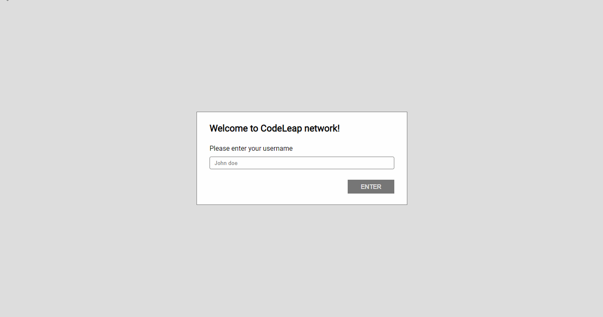

<h1 align="center">
   
    
   
    CODE LEAP ENGINEERING TEST by niloodev 🐸
   
</h1>

<h4 align="center">A simple CRUD application builded with <a href="https://pt-br.reactjs.org/" target="_blank">React</a> and <a href="https://www.typescriptlang.org/" target="_blank">TypeScript</a></h4>

  <a href="https://codeleap-code-test-psi.vercel.app/" target="_blank">Realtime</a> •
  <a href="#proposal">Proposal</a> •
  <a href="#tools">Tools</a> •
  <a href="#author">Author</a>

## Proposal
* The application must have CRUD functionalities; Create Posts, Read Posts, Update Posts and Delete Posts.
* Must be redirected to the "end consumer" and not to other developers, so usability and communicability are very important.
* Achieve the task with the best logic possible.
* Redux is necessary, and the initial folder structure should be: 
* > **/components** *for custom stuff*
* > **/actions** *for dispatched actions and NETWORK requests*
* > **/redux** *for the reducers and store*
* > **/pages** *where the actual page content will be*
* Hooks ([React Functional Components](https://pt-br.reactjs.org/docs/components-and-props.html)) instead of classes.
* Must have Signup and Main pages, with two modals. (One to delete, and the other to update posts)
* Can use any tools available.
* Follow [Figma Prototype](https://www.figma.com/file/0OQWLQmU14SF2cDhHPJ2sx/CodeLeap-Engineering-Test?node-id=5150%3A51)

## Tools

This application uses the following open-source packages:

# Core ones.
- [React](https://pt-br.reactjs.org/) (Main "framework")
- [TypeScript](https://www.typescriptlang.org/) (Strongly typed programming language that builds on JavaScript)
- [Redux](https://redux.js.org/) (Create a global state to application)

# Stylization.
- [Styled Components](https://styled-components.com/) (CSS in JS / TS styling)
- [Framer Motion](https://www.framer.com/motion/) (Animation framework)

# API CRUD and data treatment.
- [Axios](https://axios-http.com/ptbr/docs/intro) (API requests and CRUD functionalities)
- [Moment.Js](https://momentjs.com/) (DateTime converter)

# Code formatter, and other environment development tools.
- [ESLint](https://highlightjs.org/) (Javascript [linter](https://sourcelevel.io/blog/what-is-a-linter-and-why-your-team-should-use-it))
- [Prettier](https://prettier.io/) (Opinionated code formatter)
- [Figma Scheme](https://www.figma.com/file/0OQWLQmU14SF2cDhHPJ2sx/CodeLeap-Engineering-Test?node-id=5150%3A51) (Application prototype)

## Author
**made by niloodev | Ezequiel Nilo**

**ANY TIPS OR FEEDBACK IS HIGHLY APPRECIATED! 🐸**

